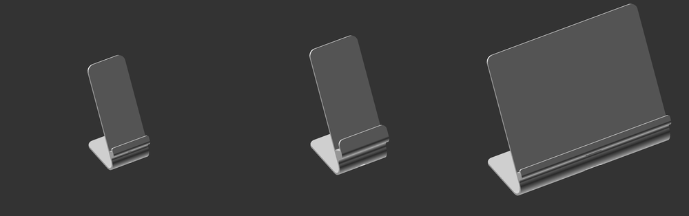
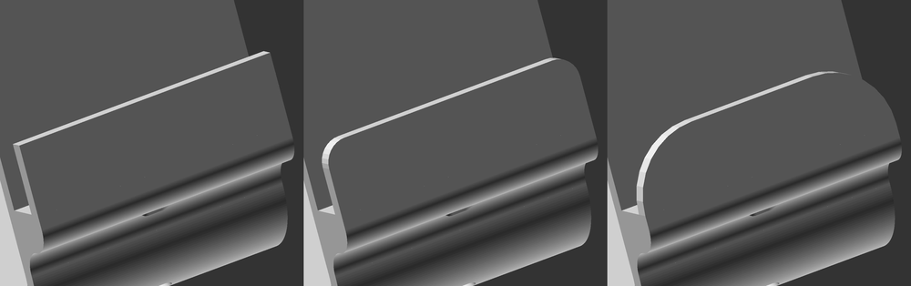
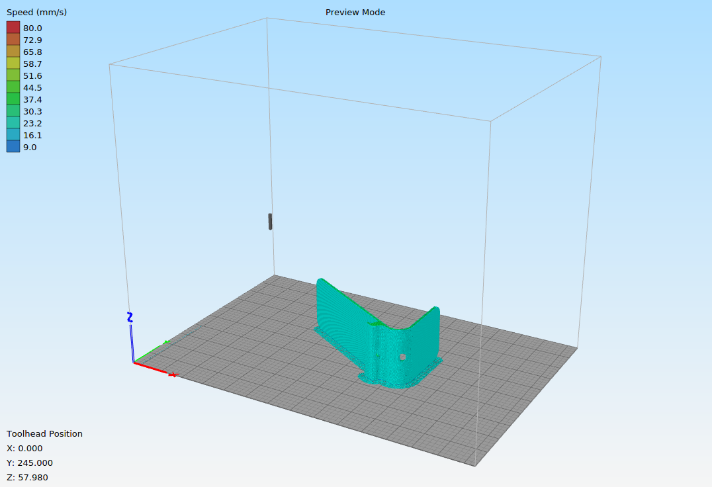

This is a customizable phone/tablet holder.

Uploaded STL is for iPhone 5S

# Parameters

## `device_dimensions`

Dimensions of device (width, height and thickness)

The main parameter which defines almost all geometry. 
Measure your device for best match and add some tolerance to all dimensions (0.5mm is ok). 
If you use case then measure it within a case. 

Examples for iPhone 5S (`[58,124,8]`), Huawei Nova 2 (in case) (`[75,145,16]`) and Samsung Galaxy Tab 2 (`[238, 169, 10]`)

## `charger_dimensions`

Dimensions of charger cable (width, height and thickness), include some wire in charger height

Examples for iPhone 5S (`[8, 40, 5]`), Huawei Nova 2 (in case) (`[12, 50, 7]`) and Samsung Galaxy Tab 2 (`[30, 50, 8]`)

![Examples for iPhone 5S (`[8, 40, 5]`), Huawei Nova 2 (in case) (`[12, 50, 7]`) and Samsung Galaxy Tab 2 (`[30, 50, 8]`)](charger_dimensions.png)

## `charger_position_factors`

Since most devices has charger hole in middle of bottom - default settings must be good,
however if you have some exotic device with charger in the left or right bottom corner you must
tune this parameter.

To compute factors using direct offsets in mm

    charger_position_factors = [offset_from_left_edge_in_mm / device_dimensions[0], offset_from_bottom_edge_in_mm / device_dimensions[2]]

Examples for `[0.1,0.5], [0.5, 0.1] and [0.9, 1.0]` offsets

![Examples for `[0.1,0.5], [0.5, 0.1] and [0.9, 1.0]` offsets](charger_position.png)

## `front_support_height`

Height of front support. Set to zero if you dont want front support at all.

Examples for 0, 5 and 15 mm

## `front_support_fillet`

Front support fillet radius. Must be less or equal to `front_support_height`

Examples for 0, 5 and 15 mm

## `holder_thickness`

Thickness of whole holder

Examples for 2, 3 and 5 mm

## `holder_fillet`

Fillet radius for base and foot parts

Examples for 0, 10 and 20 mm

## `holder_angle`

Angle of holder

Examples for 30, 50 and 70 degrees

## `holder_cut_factor`

Factor to cut base.
Great filament saver, but be sure that it isn't very short - `0.5` usually a good value to stick with it

Examples for 0.0, 0.25 and 0.5

## `shelf_shape`

Shape of shelf - possible values are "darc" (double arc), "arc" or "tri" (triangle - original variant)

Examples for "darc", "arc" and "tri"

## `shelf_additional_height`

Additional height of shelf to allow some smoothing. 
Set it to zero if you want flat shelf.
Defaults to `device thickness + holder thickness`

Examples for 0mm, `default` and 30mm

## `arc_radius`

Radius of main holder arc - by default its computed depending on `charger_dimensions[1]` (i.e. height of charger),
in most cases computed value must be ok,
but if you wish to make an arc larger or smaller you can adjust this value (BUT be sure that charger cable will fit)

Examples for 5mm, `default` and 30mm

## `foot_length`

Length of foot - by default its computed as projection of mounted device to the table.
In most cases computed value must be ok,
but if you wish to make foot larger or smaller you can adjust this value (BUT be sure that the holder will be stable)

Examples for 30mm, `default` and 100mm

## `pattern_outlines`

Outline for pattern fills (defaults to `holder_thickness`).
Array with 2 values (for base and foot correspoding)

Examples for `[2, 2]`, `[5, 5]` and `[10, 10]`

![Examples for `[2, 2]`, `[5, 5]` and `[10, 10]`](pattern_outlines.png)

## `pattern_presets`

Selected pattern fill presets (see below about preset indexes)
Array with 2 numeric values (for base and foot correspoding)

# Patterns

Each image corresponds to preset pattern.

Example: 

    pattern_presets = [10, 20]

means that `10` pattern will be used for base 
and `20` pattern for foot

# Slicing

For best quality print - print it on the left or right side, i.e. rotate 90 or -90 degrees around the Y axis

